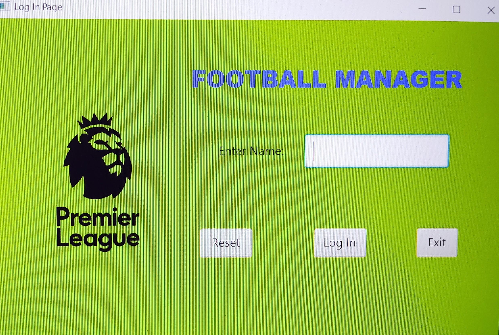
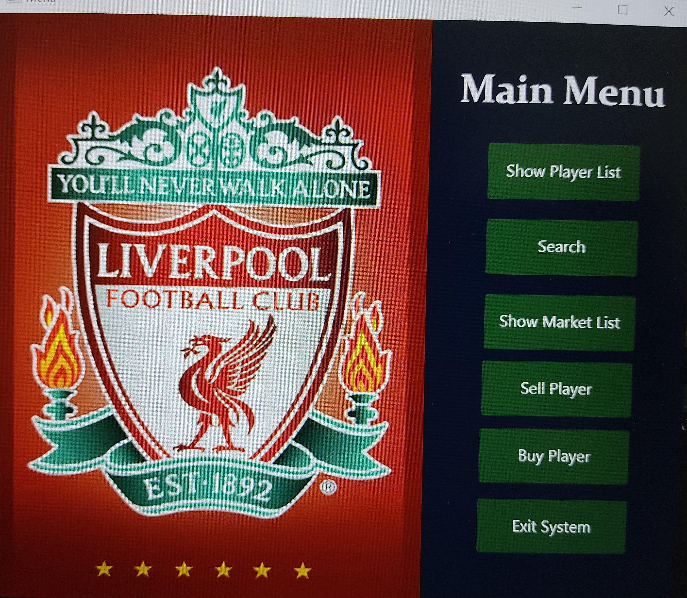
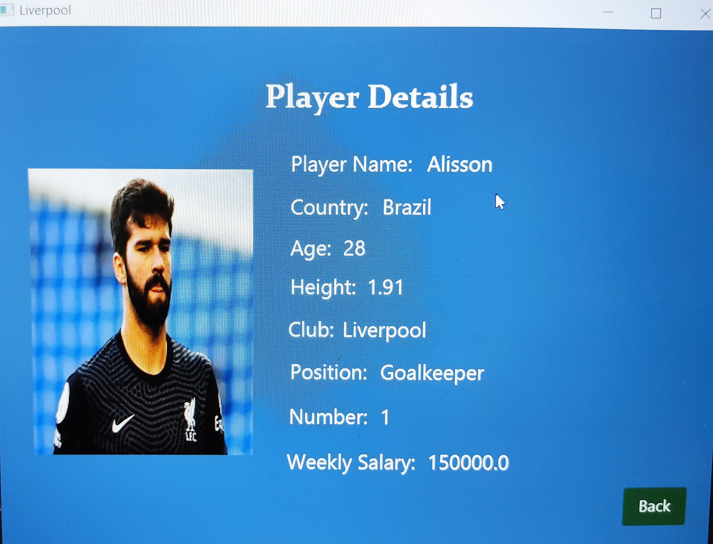

# Football Player Database System

This project is a **Football Player Database System** implemented in Java, featuring a **GUI built using JavaFX and SceneBuilder**. It manages player information for football clubs and allows operations like searching, showing details, and buying and selling of a player using **Java Networking** with concurrency support.

## Features

- Maintains a **database of players** using Java Collections.
- Each player is represented as an object with the following attributes:
  - Name
  - Country
  - Age (years)
  - Height (meters)
  - Club
  - Position (Goalkeeper, Defender, Midfielder, Forward)
  - Jersey Number
  - Weekly Salary
- Clubs are preloaded with **5 players each**, with a maximum of **7 players per club**.
- Users can login as the following 5 clubs: Manchester United, Manchester City, Chelsea, Liverpool, Arsenal.

### Main Menu Options
1. **Search Players**: Search for players based on various criteria:
   - By Player Name
   - By Club and Country
   - By Position
   - By Salary Range
   - Country-wise player count
2. **Search Clubs**: Search for players in specific clubs:
   - Player(s) with the maximum salary in a club.
   - Player(s) with the maximum age in a club.
   - Player(s) with the maximum height in a club.
   - Total yearly salary of a club.
3. **Sell Players**: 
  - Players of a club can be sold to a centralized marketplace.
4. **Buy Players**:
  - Players can be bought from a centralized marketplace.
  - Changes in the marketplace are synchronized across different club interfaces in real-time using **Java Networking**.
  - Ensures consistent marketplace updates across multiple open sessions for different clubs.
5. **Exit System**: Save all changes to `players.txt` and exit the program.

## Technologies Used
- **Java Collections** for managing player data.
- **JavaFX and SceneBuilder** for building the graphical user interface.
- **Java Networking** for implementing the marketplace functionality with real-time updates.

## Images

    
    
    

